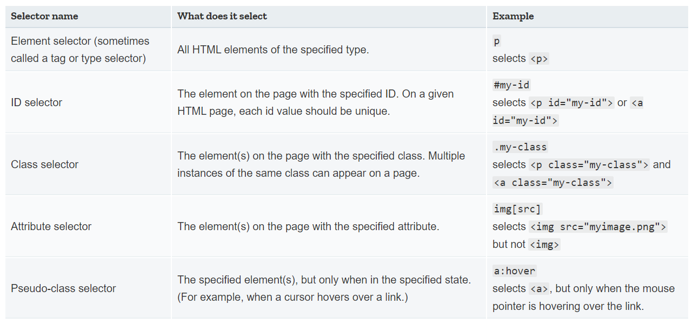

**What is CSS**
- CSS is a style sheet language, used to selectively style HTML elements.

**Anatomy of a CSS ruleset**

```
p {
    color: red;
    width: 500px;
    border: 1px solid black;
}
```
- Selector
- Declaration
- Properties
- Property value

**Selecting multiple elements**
```
p, li, h1 {
    color: red;
}
```

**Different types of selectors**

*Element selector*
 ```p```
 ```<p>```
*ID selector*
On a given HTML page, each id value should be unique.
 ```#my-id```
 ```<p id="my-id">``` or ```<a id="my-id">```
*class selector*
Multiple instances of the same class can appear on a page.
 ```.my-class```
 ```<p class="my-class">``` and ```<a class="my-class">```
*Attribute selector*
The element(s) on the page with the specified attribute.
 ```imgp[src]```
selects `````` but not ``````
*Pseudo-class selector*
The specified element(s), but only when in the specified state.
 ```a:hover```
select ```<a>```, but only when the mouse pointer is hovering over the link. 

---

**Fonts and text**
 ```
 html {
    font-size: 10px;
    font-family: "Open Sans", sans-serif;
}

h1 {
    font-size: 60px;
    text-align: center;
}

p, li {
    font-size: 16px;
    line-height: 2;
    letter-spacing: 1px;
}
 ```

 ---

 **CSS: all about boxes**
Padding, Border, Margin

